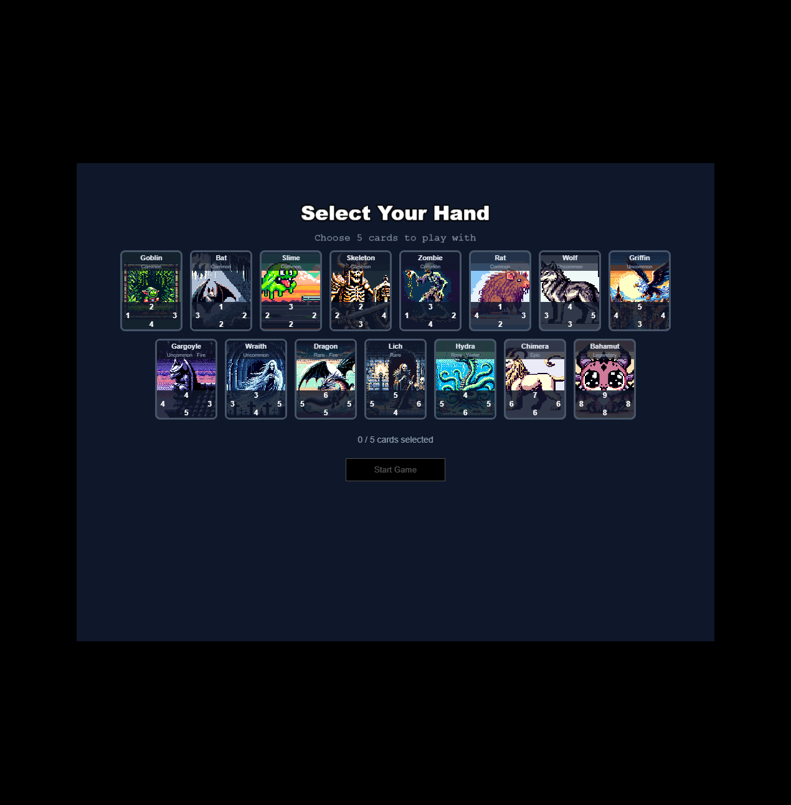

# Triple Trio

A card game inspired by Final Fantasy VIII's Triple Triad, built with Phaser 3, React, and TypeScript.

Players battle on a 3x3 grid, placing cards to capture opponents' cards using directional value comparisons, with support for advanced rules like Same, Plus, and Elemental modifiers.



## Features

- **3x3 grid card battles** with directional value-based capture
- **4 rule systems:** Basic, Same, Plus, and Elemental
- **Combo cascades** triggered by Same/Plus captures
- **AI opponent** with two difficulty levels (Easy greedy AI, Hard minimax with alpha-beta pruning)
- **Deck selection** from a pool of 15 cards across 5 rarities
- **Card artwork** displayed on board and in hand
- **Animated card placement, capture flips, and combo chains**

## Rules

| Rule | Description |
|------|-------------|
| **Basic** | A placed card captures adjacent opponent cards when its facing value is higher than the opponent's opposing value |
| **Same** | If 2+ adjacent opponent cards have equal values facing the placed card, all matching cards are captured |
| **Plus** | If 2+ adjacent pairs share the same sum (placed value + opponent value), all matching cards are captured |
| **Elemental** | Board cells have elements; matching element gives +1 to all values, mismatched element gives -1 (clamped 1-10) |

Same and Plus captures trigger combo cascades, re-evaluating newly captured cards with the Basic rule.

## Getting Started

### Requirements

[Node.js](https://nodejs.org) is required to install dependencies and run scripts via `npm`.

### Setup

```bash
npm install
npm run dev
```

The dev server runs at `http://localhost:8080` by default with hot-reloading enabled.

## Available Commands

| Command | Description |
|---------|-------------|
| `npm run dev` | Start the development server |
| `npm run build` | Create a production build in `dist/` |
| `npm run test` | Run unit tests |
| `npm run test:watch` | Run tests in watch mode |
| `npm run lint` | Run ESLint |
| `npm run lint:fix` | Auto-fix lint issues |
| `npm run format` | Format code with Prettier |
| `npm run format:check` | Check formatting compliance |
| `npm run typecheck` | Run TypeScript type checking |

## Project Structure

```
src/
├── ai/              # AI opponents (GreedyAI, MinimaxAI)
├── data/            # Card database, element definitions, types
├── engine/          # Pure game logic & rules (framework-agnostic)
│   └── rules/       # BasicRule, SameRule, PlusRule, ElementalRule
├── game/            # Phaser scenes, sprites, and animations
│   ├── scenes/      # Boot, Preloader, MainMenu, DeckSelect, Game, GameOver
│   ├── objects/     # CardSprite, BoardGrid
│   └── animations/  # Card placement, flip, glow, combo chain tweens
├── ui/              # React overlay components (hand, scores, rules, turn)
└── App.tsx          # Root React component
```

## Architecture

The game engine (`src/engine/`) is a pure TypeScript module with no framework dependencies, making it independently testable. Phaser handles rendering and animations, while React provides UI overlays for the hand, scores, and menus.

Communication between React and Phaser uses an EventBus pattern for loose coupling.

## Tech Stack

- [Phaser 3.90.0](https://github.com/phaserjs/phaser)
- [React 19.0.0](https://github.com/facebook/react)
- [Vite 6.3.1](https://github.com/vitejs/vite)
- [TypeScript 5.7.2](https://github.com/microsoft/TypeScript)
- [Vitest 2.1.0](https://github.com/vitest-dev/vitest)
